# CDL-Segmentation
This Repository contains code (will be published after paper acceptance) and benchmark results for the paper:
```
Deep Learning Based Land Cover and Crop Type Classification: A Comparative Study
```
Paper Link: https://ieeexplore.ieee.org/document/9441483
<br>
Accepted at: 2021 International Conference on Digital Futures and Transformative Technologies (ICoDT2) 

# Segmentation Models
1. UNet
2. SegNet
3. DeepLabv3+

# Pre-requistes
Main packages required are:
 - Keras
 - Tensorflow 1.15.0
 - Numpy
 - Skimage
 - Matplotlib

# Datasets
We used Google Earth Engine to generate the Dataset from Crop Land Data Layer provided by United States Department of Agriculture (USDA)
 and National Agricultural Statistics Service (NASS). Our Study area for analyzing performance of segmentation models is comprised of 9 different 
 counties of state of Nebraska, United States of America. We emphasize on Classifying two categories, thus two different datasets are:-
 (1) Cultivated and Non-Cultivated Land Cover 
 (2) Out of Cultivated area we classify the crop type i.e. Corn, Soya Bean, Winter Wheat, Alfalfa Hay and Others.

# Visual Results
Top Images are Landsat8 image, Ground-Truth and Predicted Results for cultivated area respectively (Black pixels represent non-cultivated and white pixels are cultivated area,
 whereas Bottom Images are of Landsat8, Ground-Truth and classified Crops (Yellow as Corn, Green as Soyabean, orange as Winter Wheat, Pink as Alfalfa and Black as Other crops).
 
## Cultivated/Non-Cultivated Land Cover
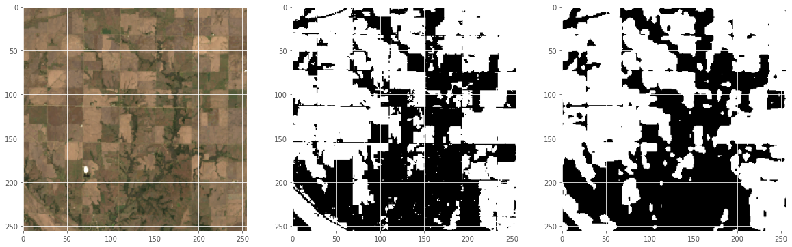
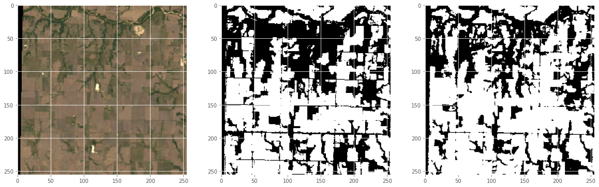
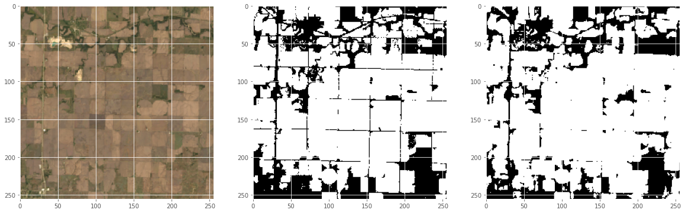
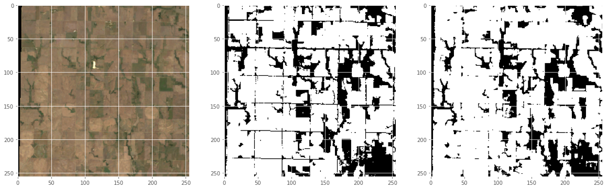
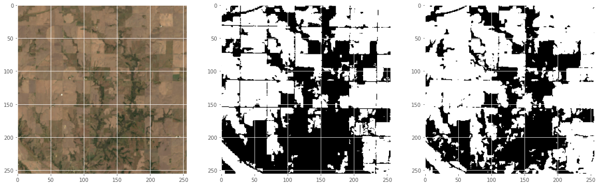
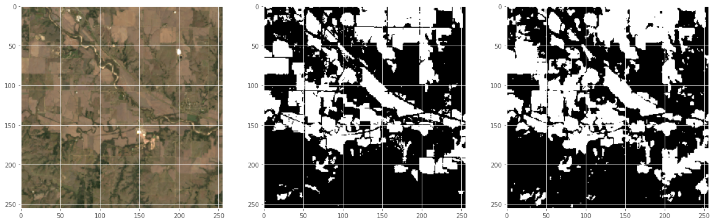

## Out of Cultivated area classified Crop Types
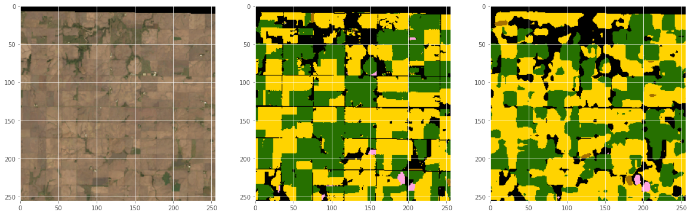
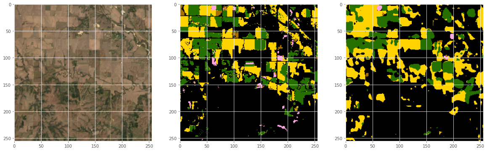
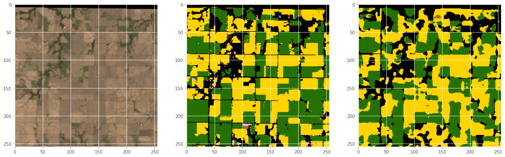
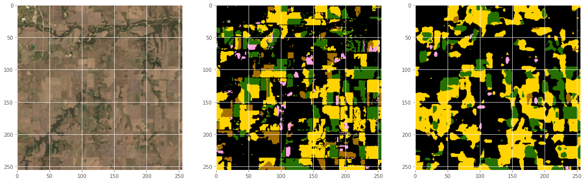
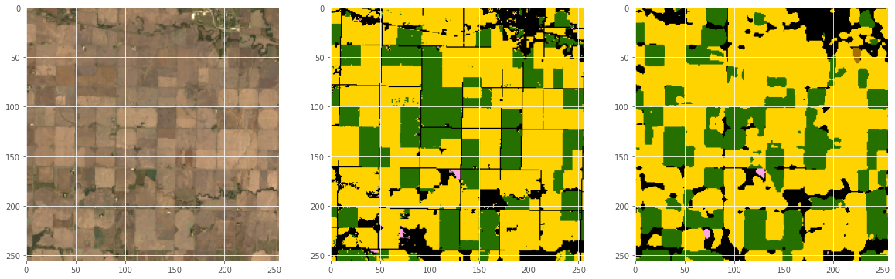
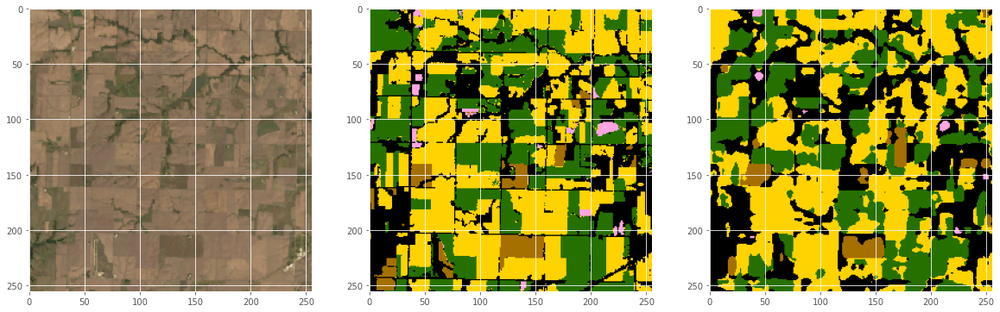

# Quantitative Results

## Dataset: LandCover Classification (Cultivated/Non-Cultivated Land area)
### UNet
Results | Values
------------ | -------------
Accuracy | 89.5
Dice co-efficient |89.2


### SegNet
Results | Values
------------ | -------------
Accuracy| 74.69
Dice co-efficient | 73.43

### DeepLabv3
Results | Values
------------ | -------------
Accuracy | 89.13
Dice co-efficient | 88.6

## Dataset Crop type Classification
### UNet
Results | Values
------------ | -------------
Accuracy | 67.3
Dice co-efficient |57.1


### SegNet
Results | Values
------------ | -------------
Accuracy| 49.5
Dice co-efficient | 37.0

### DeepLabv3
Results | Values
------------ | -------------
Accuracy | 69.7
Dice co-efficient | 62.02


# Performance Graphs

## UNet

### Part 1: Cultivated/Non-Cultivated LandCover Classification
Loss: UNet vs SegNet vs DeepLabv3

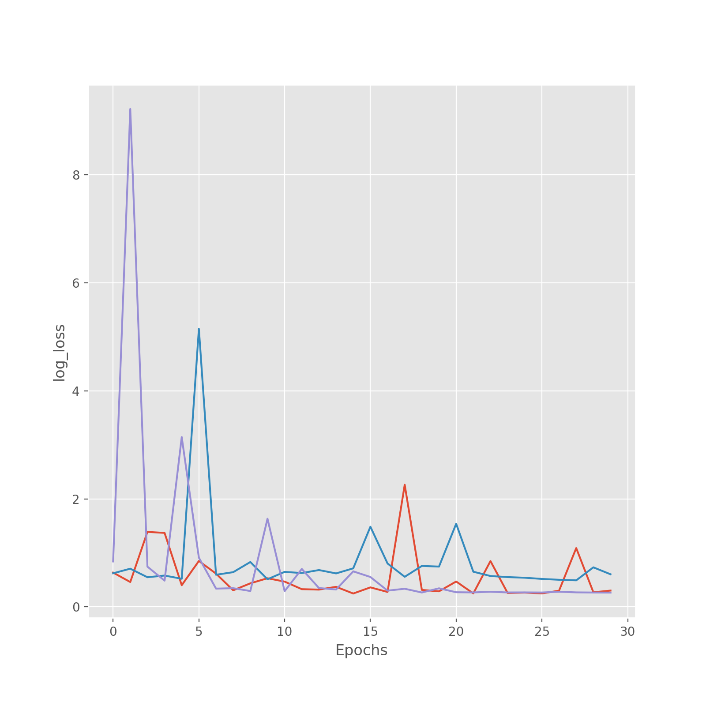
Accuracy: UNet vs SegNet vs DeepLabv3
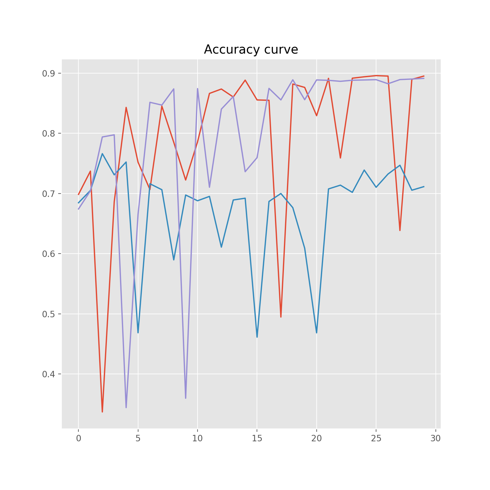
Dice Similarity Co-efficient: UNet vs SegNet vs DeepLabv3
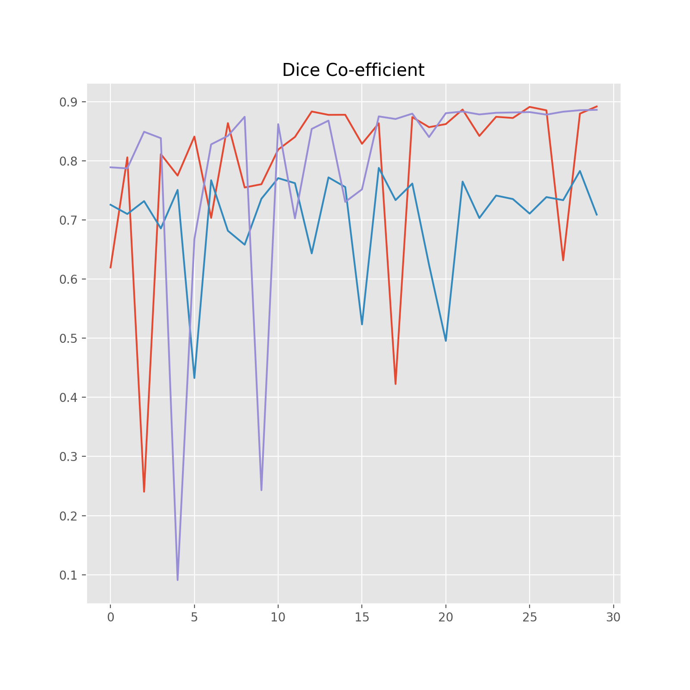

### Part 2: Crop Type Classification
Loss: UNet vs SegNet vs DeepLabv3

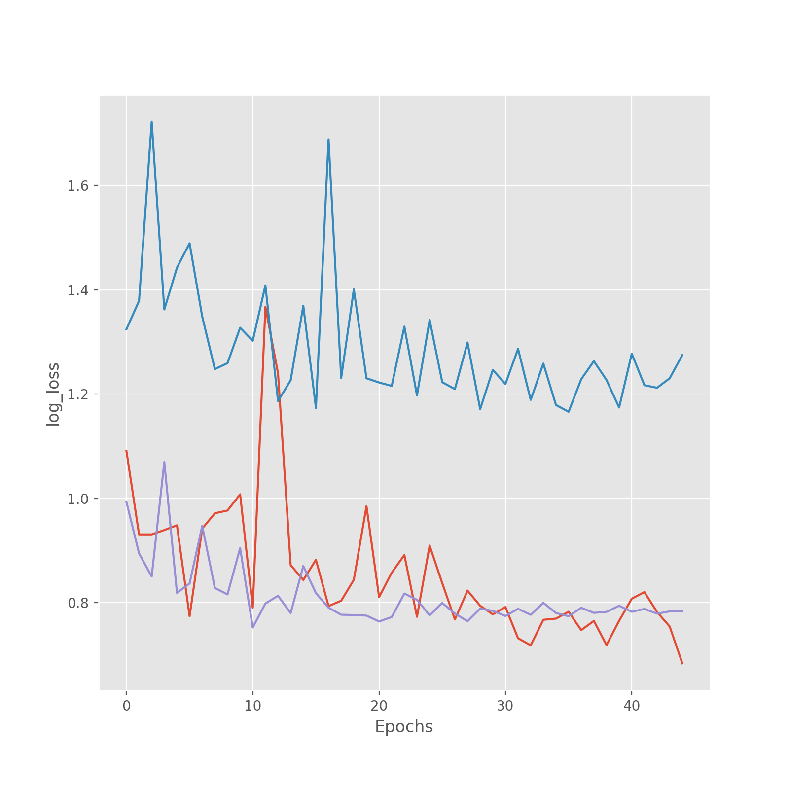
Accuracy: UNet vs SegNet vs DeepLabv3
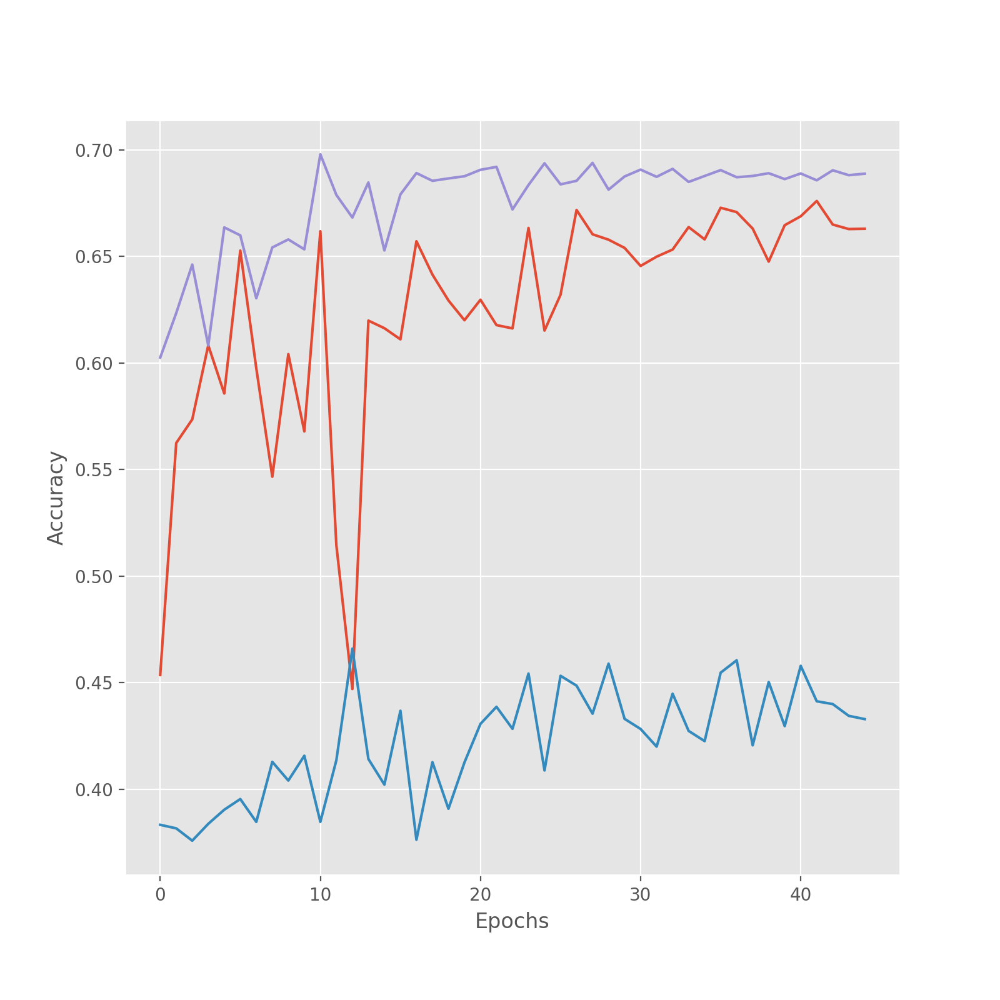
Dice Similarity Co-efficient: UNet vs SegNet vs DeepLabv3
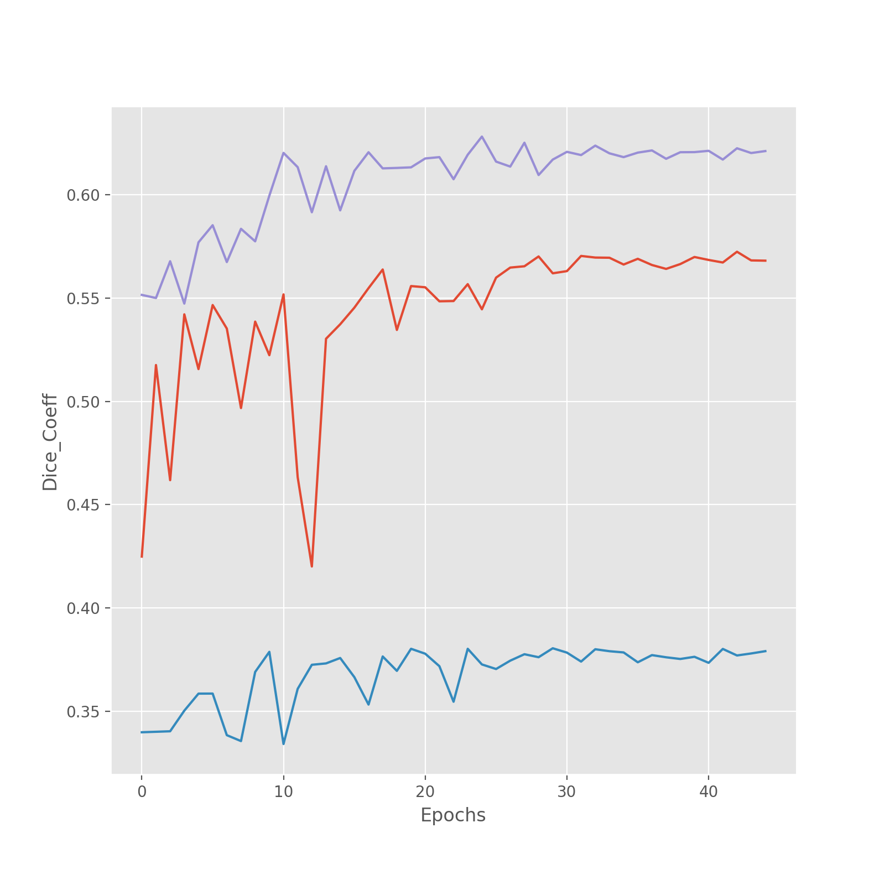


# Maintainer 
Asim Hameed Khan (asimhameed.cs@gmail.com)


